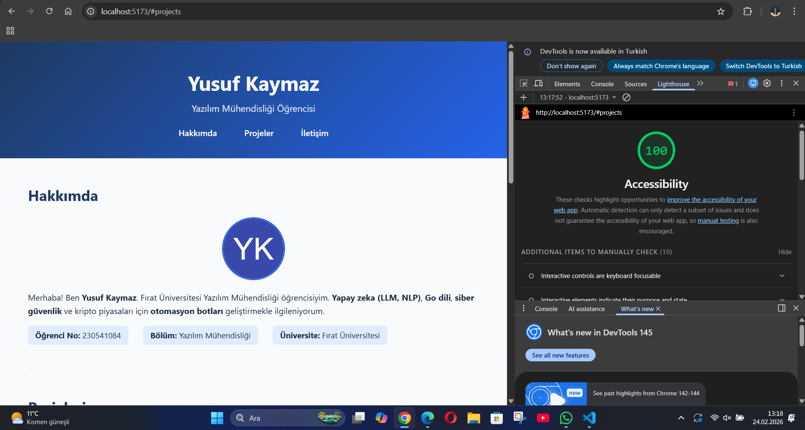
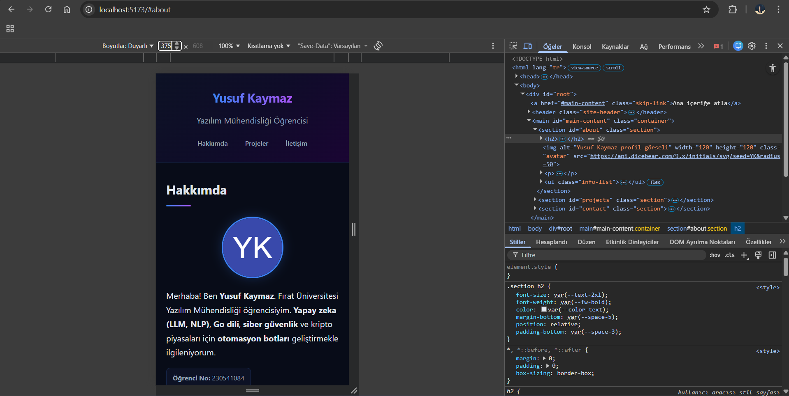
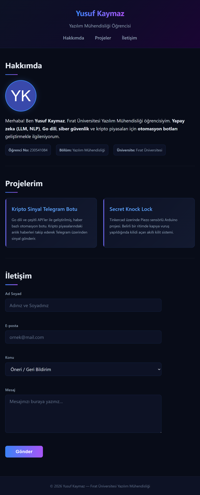
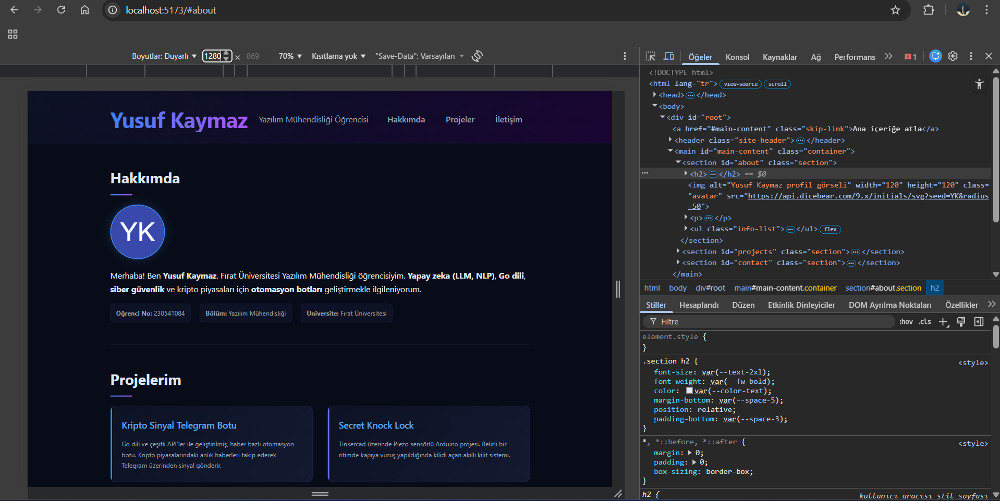

# 🌐 Kişisel Portfolyo — Yusuf Kaymaz

Web Tasarımı ve Programlama dersi laboratuvar ödevi kapsamında geliştirilmiş kişisel portfolyo web uygulaması.

---

## 👤 Geliştirici Bilgileri

| Bilgi         | Detay                                        |
| ------------- | -------------------------------------------- |
| **Ad Soyad**  | Yusuf Kaymaz                                 |
| **Öğrenci No**| 230541084                                    |
| **Bölüm**     | Yazılım Mühendisliği                         |
| **Üniversite**| Fırat Üniversitesi                           |

---

## 🛠️ Kullanılan Teknolojiler

- **React** — Bileşen tabanlı kullanıcı arayüzü kütüphanesi
- **TypeScript** — Tip güvenliği sağlayan JavaScript üst kümesi
- **Vite** — Hızlı geliştirme sunucusu ve derleme aracı
- **HTML5 Semantik Etiketler** — Erişilebilir ve anlamsal yapı
- **CSS3** — Responsive ve modern tasarım

---

## 📦 Kurulum

Projeyi yerel ortamınızda çalıştırmak için aşağıdaki adımları izleyin:

```bash
# 1. Depoyu klonlayın veya proje klasörüne gidin
cd webp

# 2. Bağımlılıkları yükleyin
npm install

# 3. Geliştirme sunucusunu başlatın
npm run dev
```

Uygulama varsayılan olarak `http://localhost:5173` adresinde açılacaktır.

---

## 📁 Proje Yapısı

```
webp/
├── public/
├── src/
│   ├── App.tsx          # Ana bileşen (Hakkımda, Projeler, İletişim)
│   ├── index.css        # Global stiller
│   ├── main.tsx         # Uygulama giriş noktası
│   └── vite-env.d.ts
├── index.html
├── package.json
├── tsconfig.json
├── vite.config.ts
└── README.md
```

---

## ✨ Özellikler

- ✅ Semantik HTML5 yapısı (`header`, `nav`, `main`, `section`, `article`, `footer`)
- ✅ Erişilebilirlik (a11y): skip-link, `aria-label`, `aria-describedby`, `role="alert"`
- ✅ Doğru heading hiyerarşisi (h1 → h2 → h3)
- ✅ İstemci taraflı form doğrulama (React state ile)
- ✅ Responsive tasarım
- ✅ Klavye gezinme desteği ve belirgin focus göstergeleri

---

## 🔦 Lighthouse Erişilebilirlik Puanı



> Lighthouse Accessibility puanı: **100 / 100**

---

## 📱 Responsive Ekran Görüntüleri

### Mobil (375px)


### Tablet (768px)


### Masaüstü (1280px)


---

## 📄 Lisans

Bu proje eğitim amaçlı geliştirilmiştir.
